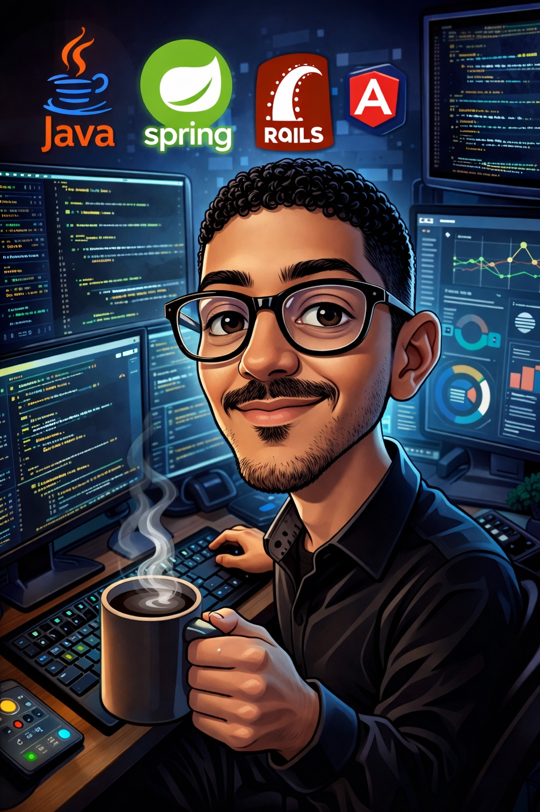

<table>
<tr>
<td width="60%">

# Hi there 👋, I'm Baha Eddine Manai

### 🚀 Full-Stack Developer & Problem Solver

I’m a passionate developer who loves turning ideas into functional and beautiful web and mobile applications.  
I enjoy exploring modern frameworks and technologies, building scalable architectures, and crafting smooth and intuitive user experiences.  

Solving challenging problems and optimizing processes motivates me every day. I constantly seek to learn and improve my skills in both front-end and back-end development.  

Whether it’s working on complex backend systems, creating interactive interfaces, or collaborating with others on ambitious projects, I focus on writing clean, maintainable code and delivering software that makes a real impact.  

I thrive in environments where creativity meets technical precision, and I’m always eager to take on new challenges that push me to grow as a developer.

</td>

<td width="40%" align="center">

  

</td>
</tr>
</table>

---

## 🛠️ Tech Stack

### 🌐 Front-End

  

### ⚙️ Back-End & Full-Stack

  

### 📱 Mobile

  

### 🗄️ Databases & Data

  

  
  

- SQL • Oracle • PL/SQL • OLAP

---

## 🧠 Methodologies & Practices

- RESTful APIs • MVC & Design Patterns  
- Agile • Scrum • Kanban  

---

## 🧰 Tools & Environment

  

- UML • Draw.io • Chart.js • DataTables • Sentry • Canva

---

## 📫 Let's Connect

  
  

---

✨ *Always learning. Always building. Always exploring.*  
🚀 *Let’s create something awesome together.*
